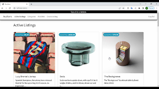

# E-commerce Auction Site

### [Video Demo](https://youtu.be/uY8-5s_B4qo)

# Description
This project is an eBay-like e-commerce auction site built using Django. It allows users to create listings with a title, description, starting bid, image URL, and category. Users can bid on listings, add them to their watchlist, and leave comments. The site also features an admin interface for managing listings, comments, and bids.

# Overview
This e-commerce auction site is built using Django and has the following features:

- Users can create listings with a title, description, starting bid, image URL, and category.
- Active listings page displays all currently active auction listings.
- Listing page displays all details about the listing, including the current price for the listing.
- Users can add listings to their watchlist and remove them.
- Users can bid on listings, and the bid must be greater than the starting bid and any other bids placed.
- The user who created the listing can close the auction, and the highest bidder becomes the winner of the auction.
- Users can add comments to the listing page.
- Watchlist page displays all of the listings that a user has added to their watchlist.
- Categories page displays all active listings in a specific category.
- Django admin interface allows site administrators to manage listings, comments, and bids.

# Technologies
This eBay-like e-commerce auction site project utilizes the following technologies:

- Django: a high-level Python web framework for rapid development and clean, pragmatic design
- SQLite: a lightweight, serverless database management system used as the default database for Django
- HTML/CSS: markup and styling languages used for creating web pages
- Bootstrap: a popular open-source toolkit for designing responsive and mobile-first websites using HTML, CSS, and JavaScript
- JavaScript: a programming language used for adding interactive and dynamic behavior to web pages

# Functionality
This project has the following functionality:

- User authentication and registration
- Create, edit, and delete listings
- Add listings to watchlist and remove them
- Bid on listings
- Close auctions and declare winners
- Leave comments on listings
- View active listings by category
- View watchlist
- Admin interface for managing listings, comments, and bids

# Usage
To use this project, follow these steps:

1. Clone the repository to your local machine.
2. Install Python and Django.
3. Create a new database using the command python manage.py migrate.
4. Start the server using the command python manage.py runserver.
5. In the project directory, run the command python manage.py runserver to start the server.
6. Open your web browser and navigate to http://localhost:8000/ to view the site.

# Credits
This project was completed as part of and based on the CS50W Project 2 specifications by Harvard University.
